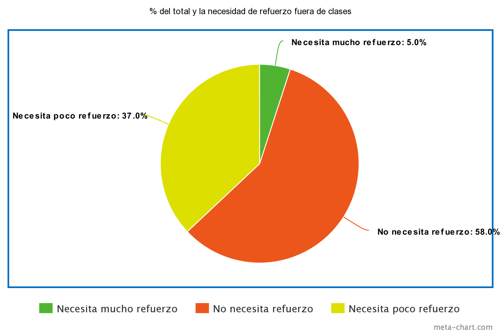
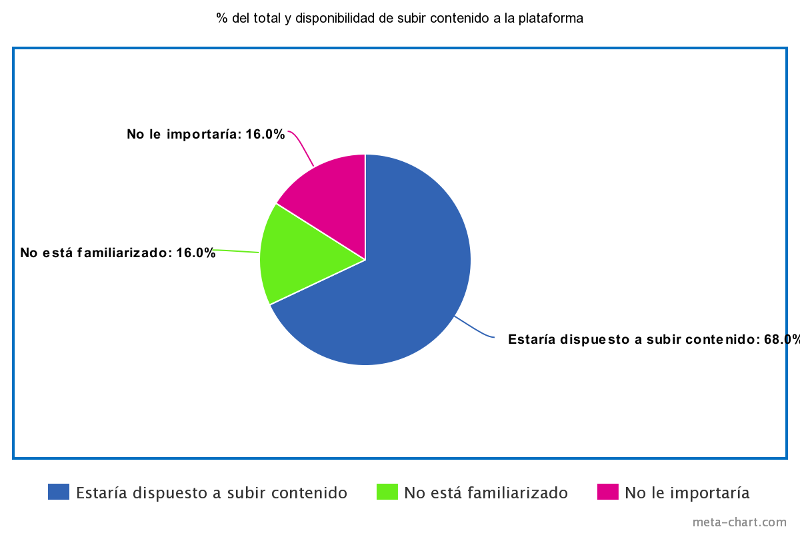
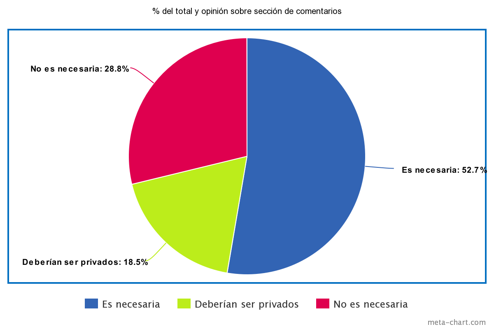
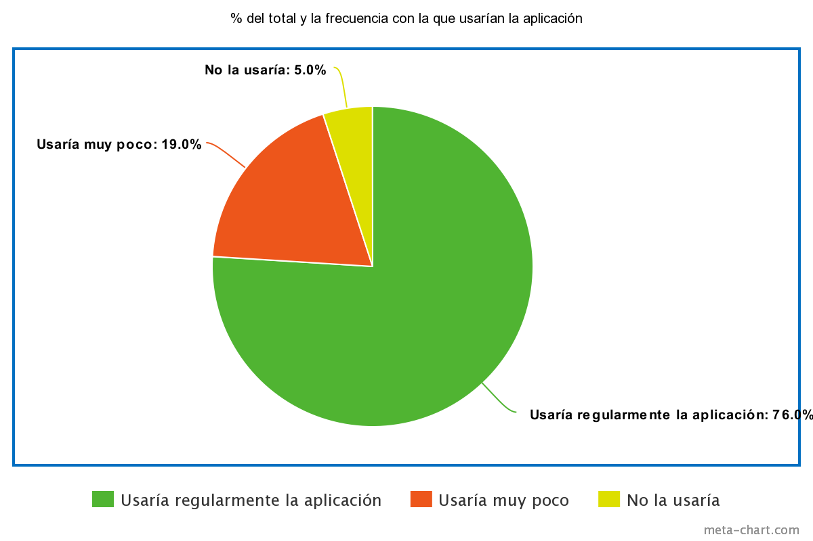

### Técnicas de recolección de requerimientos:
#### 3.1. Encuestas:
- 3.1.1 Objetivo: Recopilar información sobre las necesidades y perspectivas de los futuros usuarios de la aplicación a desarrollar, de manera muestral. Consideramos que al extender la encuesta por distintos estratos de la población escolar podremos captar mejor los puntos de vista e insights de los mismos. Además, pretendemos medir el nivel de adaptabilidad de los usuarios a herramientas tecnológicas como la que planeamos ofrecerles.
- 3.1.2. Tamaño de muestra: Se realizó la encuesta a una cantidad de 103 personas, entre alumnos y profesores, de distintas zonas de Lima y algunas de Cajatambo (95% Lima, 5% Cajatambo). Del tamaño de la población, aproximadamente 8’024,672 de alumnos en etapa escolar (de los cuales recortaremos solo los que pertenecen a los últimos 3 años de educación secundaria, es decir, distributivamente 1’604,934) (Fuente: Matrícula Minedu 2020) y 558,657 de profesores (a quienes de igual manera, partiremos en 3 por tipo de educación, obteniendo un total de 186,219) (Fuente: Censo 2017), se obtiene un margen de error del 10.21% y un nivel de confianza del 89.79% para los alumnos y un 29.55% de margen de error para los profesores, que equivaldría a un 70.45% de nivel de confianza, de que los datos reflejan el pensamiento de nuestra población. Los resultados muestran que un 92% de los encuestados fueron alumnos (79% de estos en escuelas privadas y el 21% de públicas)  y un 8% profesores (90% de escuelas privadas, 10% de escuelas públicas).

	